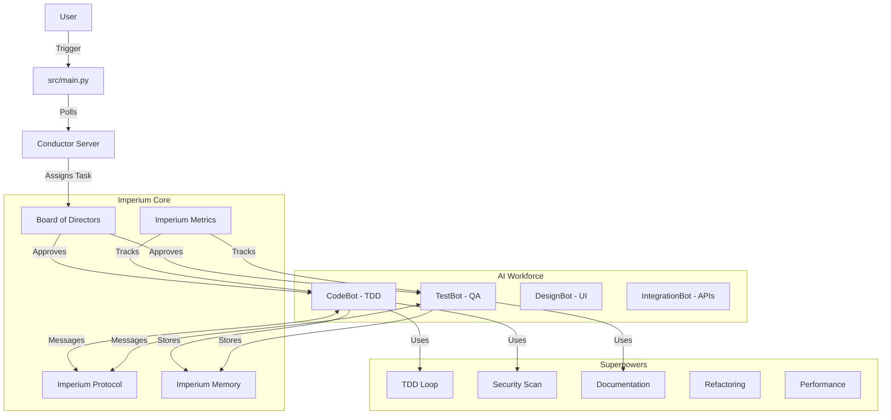

# Imperium Flow

**An Agentic Workflow Orchestrator powered by Conductor OSS and AI Agents.**


## 🌟 Overview

**Imperium Flow** is an intelligent system designed to automate complex software development tasks. It combines the robust workflow management of **Conductor OSS (Industrial-Grade Orchestration Engine)** with the adaptive intelligence of **AI Agents**.

Unlike traditional automation scripts, this system uses a "Board of Directors" model where specialized agents (`CTO`, `Product`, `Code`, `QA`) collaborate to plan, execute, and verify work.

### High-Level Architecture



## 🏛️ Imperium Systems

### Board of Directors (`src/board/directors.py`)
Strategic oversight with complexity-based routing:
| Complexity | Reviewer | Conditions |
|-----------|----------|------------|
| 1-3 | COO (Auto-approve) | None |
| 4-6 | CPO | Progress report |
| 7-8 | CTO | Daily checkpoints, code review |
| 9-10 | Full Board | Rollback plan, security audit, post-mortem |

### Imperium Protocol (`src/core/protocol.py`)
Inter-agent communication with priority queuing:
- **Priority Levels**: LOW → MEDIUM → HIGH → CRITICAL
- **CRITICAL**: Bypasses queue, triggers immediate callback
- **Intent Types**: REQUEST, NOTIFY, DELEGATE, REPORT, ESCALATE

### Imperium Memory (`src/core/memory.py`)
Shared knowledge store for continuous learning:
- Per-agent memory with categories and keys
- Cross-agent knowledge sharing
- Success rate tracking (learning from outcomes)
- Disk persistence for long-term retention

### Imperium Metrics (`src/core/metrics.py`)
Real-time performance dashboard:
- Success rate per agent
- Execution time tracking (avg, min, max)
- Error frequency analysis
- Task distribution visualization

## 🤖 AI Agents & Workers

| Agent | Role | Focus |
|-------|------|-------|
| **CodeBot** | `CODE_WORKER` | TDD (Red-Green-Refactor), commit protocols |
| **TestBot** | `TEST_WORKER` | 90% coverage, edge cases, mocking |
| **DesignBot** | `UI_WORKER` | WCAG AA accessibility, responsive |
| **IntegrationBot** | `INTEGRATION_WORKER` | API contracts, error recovery |

## ⚡ Superpowers (Skills)

| Skill | Module | Capability |
|-------|--------|------------|
| 🧠 Planning | `planning.py` | Step-by-step implementation plans |
| 🐞 Debugging | `debugging.py` | Root cause analysis & fix generation |
| 🛡️ Security | `security.py` | SAST scanning for vulnerabilities |
| 🧪 TDD | `tdd.py` | Autonomous Test-Driven Development |
| 📊 Code Analysis | `code_analysis.py` | Complexity checks & linting |
| 📝 Documentation | `documentation.py` | Auto-generated docs & diagrams |
| ♻️ Refactoring | `refactoring.py` | Code smell detection & patterns |
| ⚡ Performance | `performance.py` | Bottleneck detection & optimization |

## 📂 Project Structure

```text
Imperium-Flow/
├── .agent/                  # Agent Definitions (CodeBot, TestBot, etc.)
├── .antigravity/            # IDE Rules & Standards
├── .github/workflows/       # CI/CD Pipelines
├── src/
│   ├── main.py              # 🚀 System Entry Point
│   ├── board/               # 🏛️ Board of Directors
│   ├── core/                # Orchestrator, Protocol, Memory, Metrics
│   ├── agents/              # CodeBot, TestBot, DesignBot, IntegrationBot
│   ├── integrations/        # Conductor Client & Worker
│   ├── superpowers/         # ⚡ 8 Pluggable Skills
│   └── dashboard/           # 📊 Real-time Dashboard
├── tests/                   # 142+ Unit & Integration Tests
├── docs/                    # Architecture & Getting Started
├── examples/                # Working Examples
├── config/                  # Configuration
└── docker-compose.prod.yml  # Production Docker
```

## 🛠️ Installation & Setup

### Prerequisites
- Docker & Docker Compose
- Python 3.12+

### 1. Start Infrastructure
```bash
docker-compose up -d
```
*Access Conductor UI at [http://localhost:5000](http://localhost:5000)*

### 2. Python Environment
```bash
python3 -m venv venv
source venv/bin/activate
pip install -r requirements.txt
```

### 3. Run Imperium Flow
```bash
PYTHONPATH=. python3 src/main.py
```

## 🧪 Verification

```bash
# Run all 142+ tests
pytest tests/ -v --tb=short

# With coverage report
pytest tests/ --cov=src --cov-report=term
```

## 📖 Documentation

- [Architecture Guide](docs/architecture.md)
- [Getting Started](docs/getting-started.md)
- [Examples](examples/)

## 👥 Author & License

- **Author**: Eng. Zouaizia Nacer
- **License**: MIT
- **Repository**: [github.com/nacerdz20/Imperium-Flow](https://github.com/nacerdz20/Imperium-Flow)
