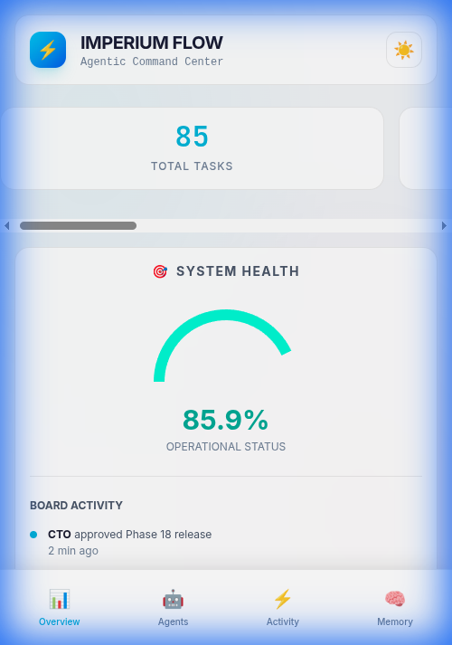
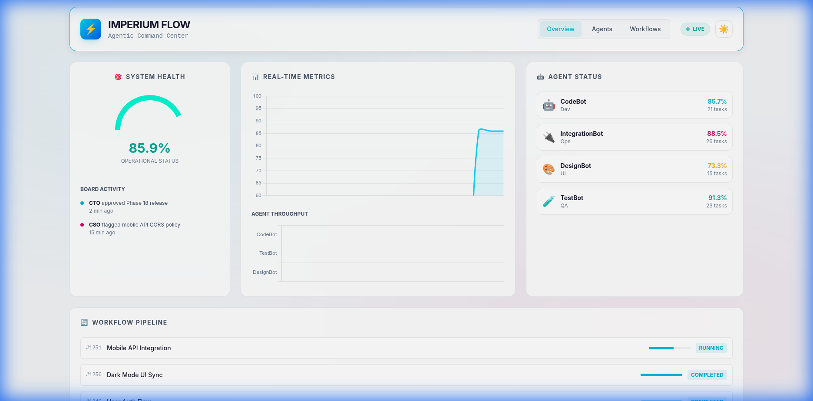

# Imperium Flow ⚡


> **Agentic Workflow Orchestrator & Command Center**
>
> An advanced system for orchestrating AI agents in complex workflows, featuring a real-time monitoring dashboard, TDD enforcement, and self-healing capabilities.

---

## 📚 Documentation

Detailed documentation is available in the `docs/` directory or at our [Documentation Site](https://nacerdz20.github.io/Imperium-Flow/).

- [**Architecture Overview**](docs/architecture.md): Understand the core design and flow.
- [**Installation Guide**](docs/installation.md): Step-by-step setup instructions.
- [**API Reference**](docs/api_reference.md): Interactive API docs details.
- [**Contributing**](docs/contributing.md): How to get involved.

---

## 🌟 Key Features

- **🤖 Multi-Agent Orchestration**: Coordinate specialized agents (CodeBot, TestBot, DesignBot, IntegrationBot) to solve complex tasks.
- **📊 Professional Dashboard**: Real-time monitoring with Dark/Light mode, mobile responsiveness, and live WebSocket updates.
- **🔄 Resilient Workflows**: Built-in retry mechanisms, deadlock detection, and self-healing logic.
- **🧪 TDD at Core**: `TDDExpert` module ensures "Red-Green-Refactor" cycles for high code quality.
- **🧠 Shared Memory**: Persistent knowledge store allowing agents to learn from past executions.
- **📱 Mobile First**: Fully responsive UI adaptable to any device size.

---

## 📸 Screenshots

### Command Center (Desktop)
A comprehensive view of system health, active tasks, and agent performance.


### Mobile & Light Mode
Optimized for on-the-go monitoring with full theme support.

| Mobile View | Light Mode |
|-------------|------------|
|  |  |

---

## 🚀 Getting Started

### Prerequisites
- **Python 3.8+**
- **Docker & Docker Compose** (for Conductor server)
- **Git**

### Installation

1. **Clone the repository**
   ```bash
   git clone https://github.com/nacerdz20/Imperium-Flow.git
   cd Imperium-Flow
   ```

2. **Create a virtual environment**
   ```bash
   python3 -m venv venv
   source venv/bin/activate  # On Windows: venv\Scripts\activate
   ```

3. **Install dependencies**
   ```bash
   pip install -r requirements.txt
   ```

4. **Start Backend (Conductor)**
   ```bash
   docker-compose up -d
   ```

---

## 🖥️ Running the Dashboard

Launch the Imperium Command Center to monitor your agents in real-time.

```bash
# Start the backend server
python3 -m uvicorn src.dashboard.app:app --host 0.0.0.0 --port 8090 --reload
```

Open your browser at: **[http://localhost:8090](http://localhost:8090)**

---

## ⚙️ Configuration (Brief)

Create a `.env` file to configure the system. See [Configuration Guide](docs/configuration.md) for details.

| Variable | Description | Default |
|----------|-------------|---------|
| `CONDUCTOR_SERVER_URL` | Conductor API URL | `http://localhost:8080/api` |
| `DASHBOARD_PORT` | Dashboard Port | `8090` |
| `LOG_LEVEL` | Logging Level | `INFO` |

---

## 🧪 Running Tests

Imperium Flow maintains high code coverage (>94%) to ensure reliability.

```bash
# Run all unit tests
pytest tests/unit
```

---

## 🤝 Contributing

Contributions are welcome! Please fork the repository and submit a Pull Request. See [Contributing Guide](docs/contributing.md).

---

## 📜 License

Distributed under the MIT License. See `LICENSE` for more information.

---

**Built with ❤️ by [Eng. Zouaizia Nacer](https://www.zouaizianacer.top/)**
