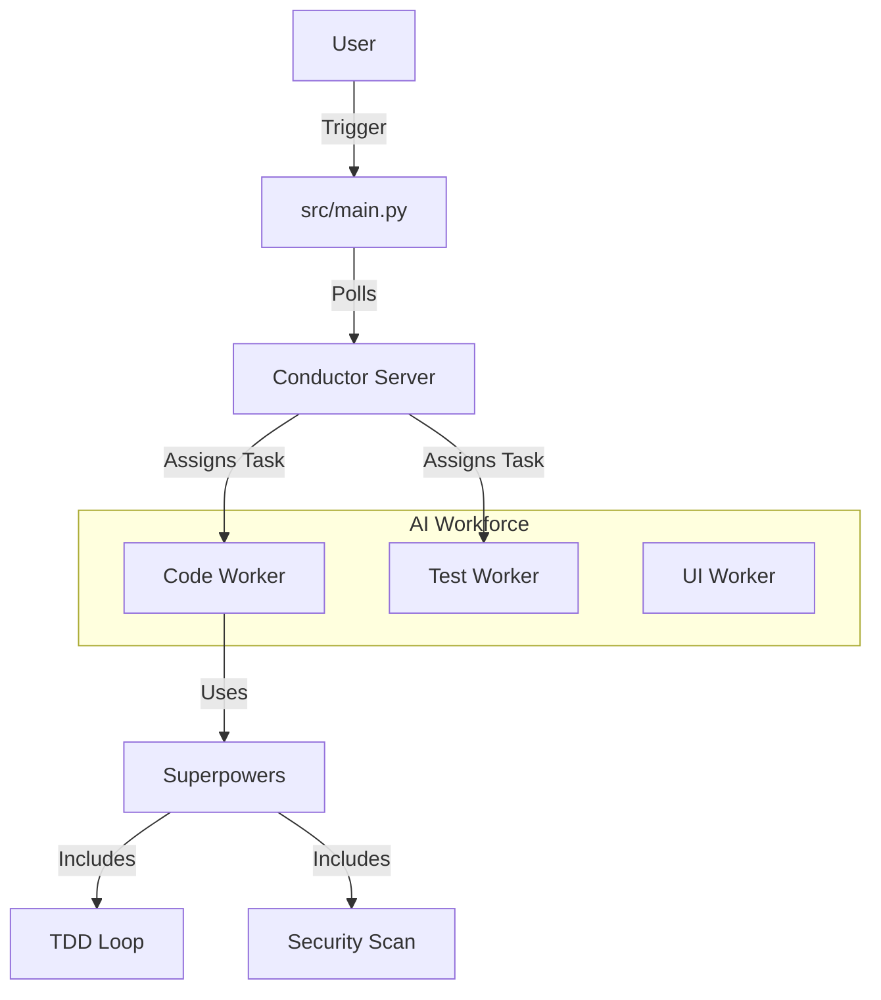

# Imperium Flow

**An Agentic Workflow Orchestrator powered by Conductor OSS and AI Agents.**


## 🌟 Overview

**Imperium Flow** is an intelligent system designed to automate complex software development tasks. It combines the robust workflow management of **Conductor OSS (Industrial-Grade Orchestration Engine)** with the adaptive intelligence of **AI Agents**.

Unlike traditional automation scripts, this system uses a "Board of Directors" model where specialized agents (`CTO`, `Product`, `Code`, `QA`) collaborate to plan, execute, and verify work.

### High-Level Architecture



## 🤖 AI Agents & Workers

The system employs specialized workers, each with a distinct persona and operational protocol (defined in `src/config/worker_templates.py`):

| Agent Name | Role | Focus |
|------------|------|-------|
| **CodeBot** | `CODE_WORKER` | Implements business logic using **TDD (Red-Green-Refactor)**. Strict adherence to commit protocols. |
| **TestBot** | `TEST_WORKER` | QA Specialist. Writes unit/integration tests ensuring defined coverage targets (e.g., 90% for core logic). |
| **DesignBot** | `UI_WORKER` | Frontend expert. Ensures accessibility (WCAG AA), responsive design, and design system compliance. |
| **IntegrationBot** | `INTEGRATION_WORKER` | Handle API contracts, external services (Supabase, Stripe), and error recovery strategies. |

## ⚡ Superpowers (Skills)

Agents are equipped with dynamic skills located in `src/superpowers/`:

- **🧠 Planning (`planning.py`)**: breakdowns complex requests into step-by-step implementation plans.
- **🐞 Debugging (`debugging.py`)**: Systematic root cause analysis and fix generation.
- **🛡️ Security (`security.py`)**: Basic SAST scanning for vulnerabilities before code is committed.
- **🧪 TDD (`tdd.py`)**: Autonomous Test-Driven Development loop: *Write Test -> Fail -> Write Code -> Pass*.
- **📊 Code Analysis (`code_analysis.py`)**: Cyclomatic complexity checks and linting.

## 📂 Project Structure

```text
zouaizia-nacer-orchestrator/
├── docker-compose.yml       # Infrastructure (Conductor, UI, Redis, Elastic)
├── src/
│   ├── main.py              # 🚀 System Entry Point
│   ├── core/                # Core Orchestration Logic
│   │   ├── orchestrator.py  # ZNOrchestrator Engine
│   │   ├── agent_manager.py # Manages Agent Lifecycle
│   │   └── llm.py           # Interface to LLM Providers
│   ├── agents/              # Agent Implementations
│   │   └── worker.py        # Generic WorkerAgent Class
│   ├── integrations/        # External Systems
│   │   ├── conductor_client.py # Conductor API Client
│   │   └── conductor_worker.py # Bridge: Conductor Task -> Agent
│   └── superpowers/         # ⚡ Pluggable Agent Skills
├── tests/                   # Unit and Integration Tests
└── config/                  # Configuration & Templates
```

## 🛠️ Installation & Setup

### Prerequisites
- Docker & Docker Compose
- Python 3.12+

### 1. Start Infrastructure
Launch the Conductor stack. This spins up the Server, UI, Redis, and Elasticsearch.

```bash
docker-compose up -d
```
*Wait ~1 minute. Access the Conductor UI at [http://localhost:5000](http://localhost:5000).*

### 2. Python Environment
Create and activate a virtual environment:

```bash
python3 -m venv venv
source venv/bin/activate
pip install -r requirements.txt
```

### 3. Run the Orchestrator
Start the system. This initializes the agents and begins polling Conductor for tasks.

```bash
PYTHONPATH=. python3 src/main.py
```

## 🧪 Verification

To verify the "Bridge" logic (connection between Conductor and Agents) without a full workflow:

```bash
python3 -m unittest tests/test_conductor_worker.py
```

## � Contribution

- **Author**: Eng. Zouaizia Nacer
- **License**: MIT
