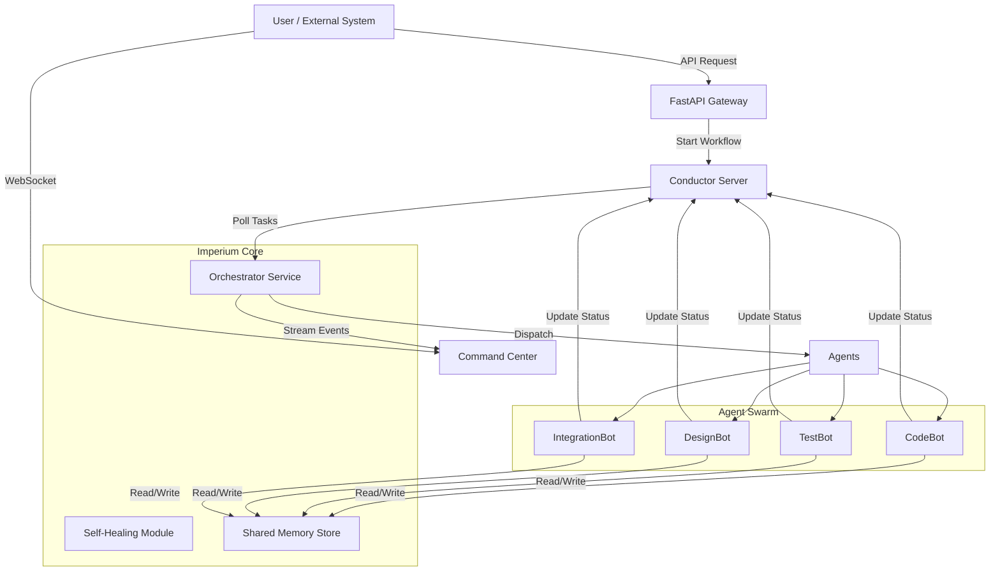
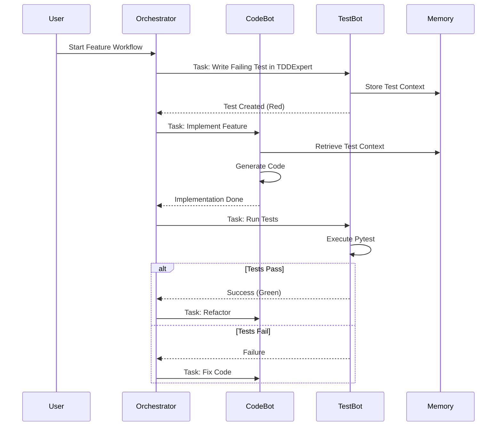

# System Architecture

Imperium Flow is designed as a modular, event-driven system leveraging the **Agentic Workflow** pattern. It separates orchestration logic from agent execution, ensuring scalability and resilience.

## High-Level Overview

The system consists of three main layers:
1. **Orchestration Layer**: Manages workflow state and task distribution (Conductor).
2. **Agent Layer**: Specialized workers that execute tasks (CodeBot, TestBot, etc.).
3. **Interface Layer**: Real-time dashboard and API for monitoring and control.



## Core Components

### 1. Orchestrator (`src.core.orchestrator`)
The central brain that polls Conductor for tasks and delegates them to the appropriate agents. It implements the **Board of Directors** pattern, where different "personalities" (CTO, CSO, Product Owner) review decisions.

### 2. Agents (`src.agents`)
Autonomous units with specific "Superpowers".
- **CodeBot**: Generates and refactors code using LLMs.
- **TestBot**: Writes and executes TDD cycles.
- **DesignBot**: Handles UI/UX tasks.
- **IntegrationBot**: Manages API integrations and deployments.

### 3. Shared Memory (`src.core.memory`)
A semantic knowledge store that allows agents to share context.
- **Short-term**: Current workflow context.
- **Long-term**: Learned patterns and successful strategies.

### 4. Self-Healing (`src.core.maintenance`)
Monitors for deadlocks, timeouts, and failures. It can trigger retry strategies or escalate to human intervention.

## Workflow Execution Flow

A typical "Feature Implementation" workflow follows this Red-Green-Refactor cycle:



## Directory Structure

```plaintext
Imperium-Flow/
├── src/
│   ├── agents/         # Specific agent implementations
│   ├── core/           # Core logic (Orchestrator, Memory, Config)
│   ├── dashboard/      # FastAPI + HTML/JS Dashboard
│   ├── superpowers/    # Pluggable capabilities (TDD, Planning)
│   └── main.py         # Entry point
├── tests/              # Unit and Integration tests
├── docs/               # Documentation
└── ...
```

## Tech Stack

- **Language**: Python 3.9+
- **Orchestration**: Netflix Conductor (via `conductor-python`)
- **Web Framework**: FastAPI (Dashboard & API)
- **Frontend**: HTML5, TailwindCSS, Chart.js, WebSockets
- **Containerization**: Docker & Docker Compose
