# Imperium Flow Architecture

## System Overview

Imperium Flow is a multi-agent orchestration system that uses AI agents to coordinate complex software development workflows with Board oversight, quality gates, and shared memory.

## Architecture Diagram

```mermaid
graph TD
    User["👤 User"] -->|Submit Task| Orchestrator["🎯 ZNOrchestrator"]
    
    Orchestrator -->|Review Request| Board["🏛️ Board of Directors"]
    Board -->|Decision| Orchestrator
    
    Orchestrator -->|Delegate| CodeBot["🤖 CodeBot"]
    Orchestrator -->|Delegate| TestBot["🧪 TestBot"]
    Orchestrator -->|Delegate| DesignBot["🎨 DesignBot"]
    Orchestrator -->|Delegate| IntBot["🔌 IntegrationBot"]
    
    CodeBot -->|Messages| Protocol["📡 MessageBus"]
    TestBot -->|Messages| Protocol
    DesignBot -->|Messages| Protocol
    IntBot -->|Messages| Protocol
    
    Protocol -->|Route| Memory["🧠 Memory"]
    Orchestrator -->|Track| Metrics["📊 Metrics"]
    Orchestrator -->|Validate| QG["🔒 Quality Gates"]
```

## Component Descriptions

### Core Systems

| Component | File | Purpose |
|-----------|------|---------|
| **Orchestrator** | `src/core/orchestrator.py` | Coordinates workflows, manages agents, enforces quality |
| **Protocol** | `src/core/protocol.py` | Inter-agent messaging with priority queuing |
| **Memory** | `src/core/memory.py` | Shared knowledge store with persistence |
| **Metrics** | `src/core/metrics.py` | Performance tracking and dashboard |
| **Quality Gates** | `src/core/quality_gates.py` | 6 real validators (coverage, complexity, security, type, lint, test) |
| **Skills Registry** | `src/core/skills_registry.py` | Plugin system mapping agents to superpowers |
| **Agent Manager** | `src/core/agent_manager.py` | Agent registration and retrieval |

### Agents

| Agent | File | Skills | Role |
|-------|------|--------|------|
| **CodeBot** | `src/agents/codebot.py` | TDD, Security, CodeAnalysis, Refactoring | Code implementation |
| **TestBot** | `src/agents/testbot.py` | TDD, CodeAnalysis, Debugging | Test generation |
| **DesignBot** | `src/agents/designbot.py` | CodeAnalysis, WCAG Validation | UI design |
| **IntegrationBot** | `src/agents/integrationbot.py` | Security, Debugging, Performance | External services |

### Board of Directors

Routes decisions by complexity:
- **COO** (1-3): Auto-approve simple tasks
- **CPO** (4-6): Review features and UX
- **CTO** (7-8): Review architecture and security
- **Strategic Director** (9-10): Critical strategic decisions

### Superpowers

| Superpower | File | Capability |
|------------|------|------------|
| TDD Expert | `src/superpowers/tdd.py` | Real test execution with pytest |
| Security Scanner | `src/superpowers/security.py` | SAST with pattern matching |
| Code Analyzer | `src/superpowers/code_analysis.py` | AST-based complexity analysis |
| Smart Planner | `src/superpowers/planning.py` | Task decomposition |
| Debugger | `src/superpowers/debugging.py` | Systematic debugging |
| Documentation | `src/superpowers/documentation.py` | Auto-doc generation |
| Refactoring | `src/superpowers/refactoring.py` | Code smell detection |
| Performance | `src/superpowers/performance.py` | Bottleneck analysis |

## Workflow Lifecycle

